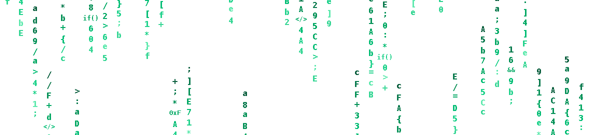
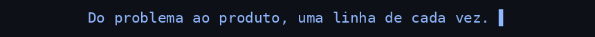
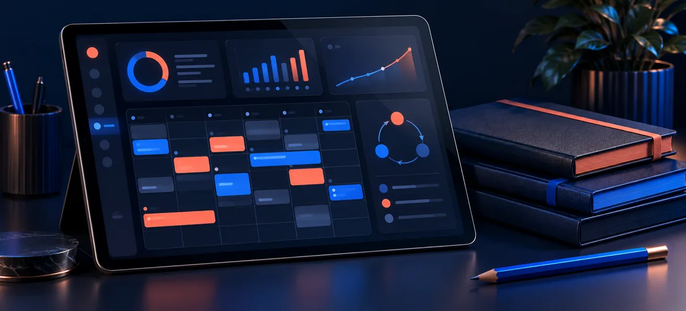
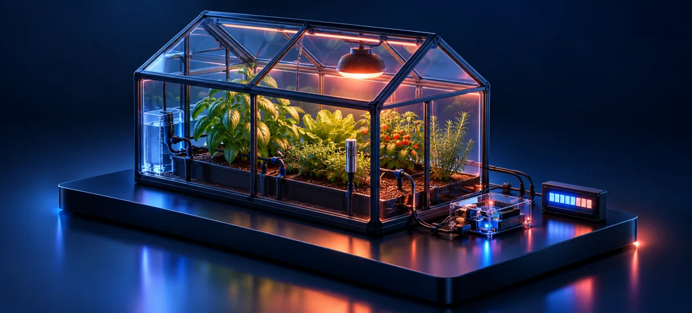
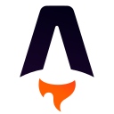
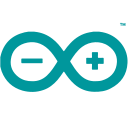
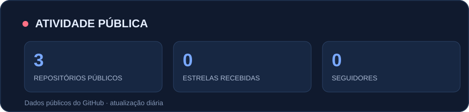
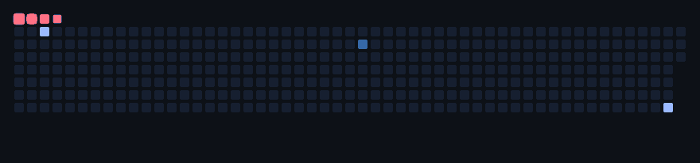

<!-- Perfil de Davi Travassos · mantenha este arquivo na raiz do repositório público Davitmatoss/Davitmatoss. -->

  

   

  # Davi Travassos de Matos

  **Desenvolvedor de software · interfaces, sistemas e ideias que saem do papel**

   

  

    

  <a href="#-projetos-em-destaque">Projetos</a> &nbsp;·&nbsp;
  <a href="#-tecnologias">Tecnologias</a> &nbsp;·&nbsp;
  <a href="#-minha-trajetória">Trajetória</a> &nbsp;·&nbsp;
  <a href="#-vamos-conversar">Contato</a>

    

  
  
  

 

## 👋 Olá, eu sou o Davi

Sou estudante de **Desenvolvimento de Sistemas no SENAI** e do Ensino Médio no **SESI**. Gosto de transformar uma necessidade real em uma experiência digital clara: entender o problema, desenhar o fluxo, implementar a solução e melhorar os detalhes até fazer sentido para quem vai usar.

Meu trabalho passa por **front-end, back-end, integrações, dados e prototipagem com IoT**. Tenho interesse especial em produtos digitais, automação e aplicações práticas de inteligência artificial. Estou em Campinas, SP, e busco oportunidades para aprender com equipes, colaborar e entregar software útil.

> **O que me move:** criar com intenção, aprender na prática e cuidar tanto da lógica quanto da experiência.

 

## ✦ Projetos em destaque

<table>
  <tr>
    <td width="50%" valign="top">
      
      <h3>01 / Minha Agenda I.A</h3>
      
Assistente financeiro com conversa em linguagem natural, categorização de despesas e visualização de gastos e planejamentos.

      
<strong>Python · Flask · JavaScript · Gemini API · SQLAlchemy · Chart.js</strong>

      <a href="https://github.com/Davitmatoss/Minha-Agenda-IA"><strong>Explorar código →</strong></a>
    </td>
    <td width="50%" valign="top">
      
      <h3>02 / FlowSolo</h3>
      
Plataforma para profissionais autônomos organizarem orçamentos, gestão e cobranças em um só fluxo. O repositório é privado.

      
<strong>React · Next.js · TypeScript · Tailwind CSS · Zustand</strong>

      <a href="mailto:davitmatoss@gmail.com?subject=FlowSolo"><strong>Pedir uma demonstração →</strong></a>
    </td>
  </tr>
  <tr>
    <td width="50%" valign="top">
      
      <h3>03 / ROTA 90</h3>
      
Sistema digital de preparação para ENEM e vestibulares, com prioridades, cronogramas, revisão espaçada e acompanhamento. Código privado.

      
<strong>Astro · TypeScript · CSS</strong>

      <a href="https://github.com/Davitmatoss?tab=repositories"><strong>Ver meu perfil →</strong></a>
    </td>
    <td width="50%" valign="top">
      
      <h3>04 / Estufa inteligente</h3>
      
Protótipo de automação climática com leitura de sensores, lógica para irrigação e controle térmico, e dados em display LCD.

      
<strong>Arduino · C/C++ · sensores · IoT</strong>

      <a href="mailto:davitmatoss@gmail.com?subject=Estufa%20inteligente"><strong>Conversar sobre o protótipo →</strong></a>
    </td>
  </tr>
</table>

<strong>Outros caminhos que estou explorando</strong>

 

- **QuarkAgent** — projeto em TypeScript com código privado.
- **Neon Drift: Midnight Rush** — jogo de corrida arcade com autenticação Supabase; código privado.
- **ClubEvolution** — landing page de produto digital com repositório privado.

 

## 🧰 Tecnologias

### Interfaces e produtos web

   &nbsp;
   &nbsp;
   &nbsp;
   &nbsp;
   &nbsp;
   &nbsp;
   &nbsp;
  

TypeScript · JavaScript · HTML · CSS · React · Next.js · Astro · Tailwind CSS

### Back-end, lógica e dados

   &nbsp;
   &nbsp;
   &nbsp;
   &nbsp;
   &nbsp;
  

Python · Flask · C++ · Java (estudos) · MySQL · SQLite

### Ferramentas e prototipagem

   &nbsp;
   &nbsp;
   &nbsp;
  

Git · GitHub · GitLab · Arduino &nbsp; / &nbsp; Ícones oficiais: <a href="https://devicon.dev/">Devicon</a>.

  

## 📍 Minha trajetória

| Hoje | Onde isso aparece |
| :--- | :--- |
| **Técnico em Desenvolvimento de Sistemas** no SENAI | Projetos web, lógica, banco de dados e integração de sistemas |
| **Ensino Médio** no SESI Campinas Amoreiras | Base acadêmica e trabalho em equipe |
| **Inglês em desenvolvimento** no CNA | Leitura, documentação e comunicação em inglês |
| **Além do código** | Organização, comunicação, apresentação de ideias e aprendizado contínuo |

 

## 📊 Atividade no GitHub

Dados públicos do GitHub. <a href="https://github.com/Davitmatoss?tab=overview">Ver o gráfico de contribuições ↗</a>

 

## 🐍 Um pouco de movimento

Meu calendário público em movimento · <a href="./assets/github-snake.svg">abrir versão SVG animada</a> · <a href="https://github.com/Platane/snk">Platane/snk</a>.

 

## ✉️ Vamos conversar

Se você está construindo um projeto, formando uma equipe ou tem uma oportunidade de desenvolvimento, gosto de boas conversas e desafios com propósito claro.

  
  
    
  Assinado: Davi Travassos

